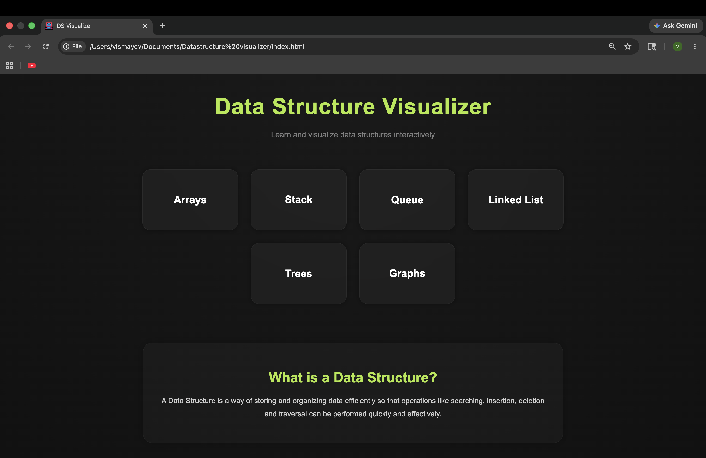
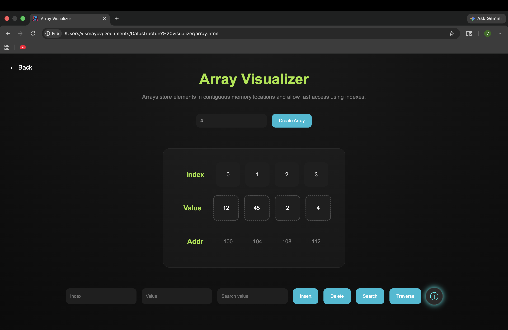
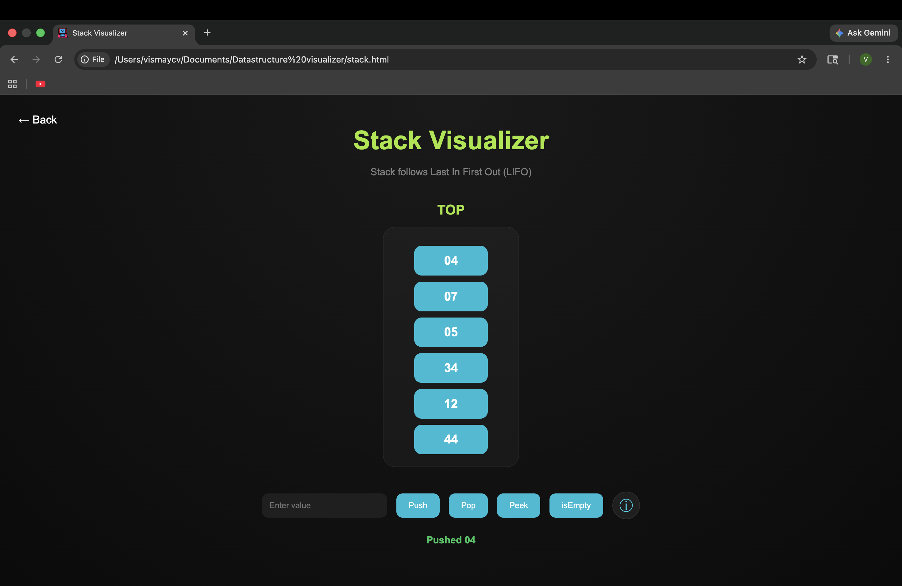
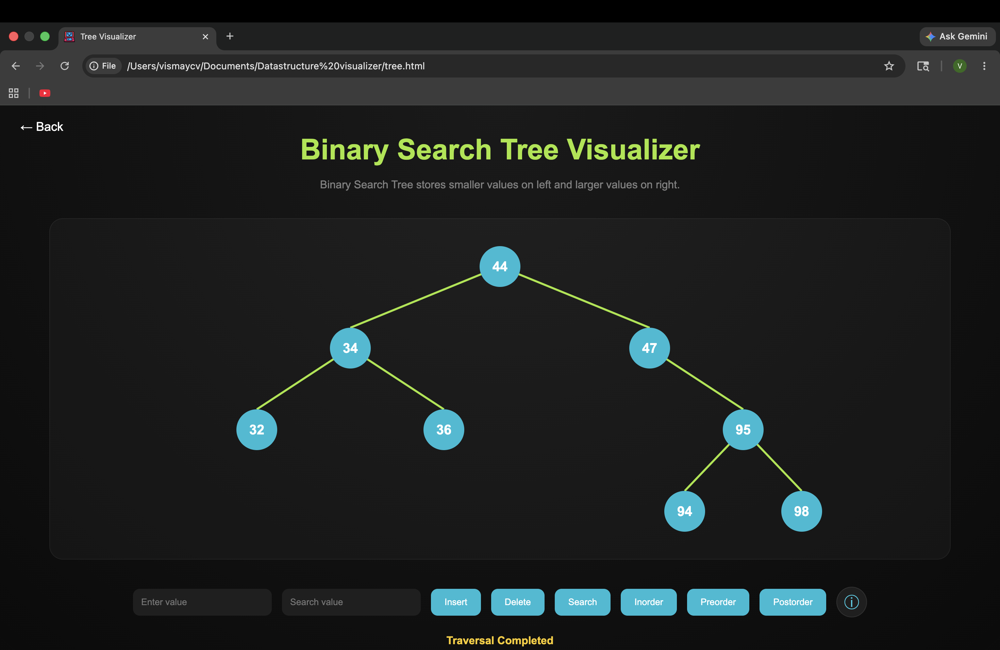
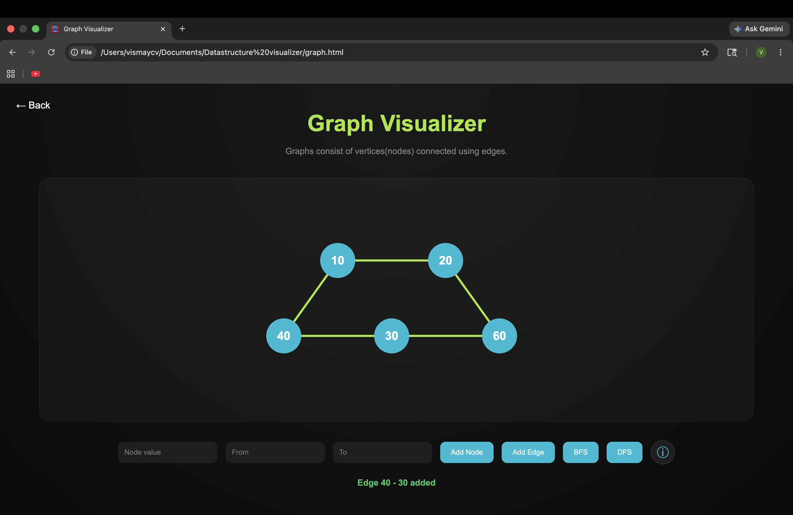

# Data Structure Visualizer

An interactive Data Structure Visualizer built using HTML, CSS and JavaScript to help students understand data structures through animations and visual learning.

---

## Features

- Array Visualization
- Stack Operations
- Queue Operations
- Linked List Visualization
- Binary Search Tree Visualization
- Graph Traversals (BFS & DFS)
- Interactive Animations
- Time Complexity Information
- Modern Dark UI Design

---

## Technologies Used

- HTML
- CSS
- JavaScript

---

## Screenshots

### Homepage

---

### Array Visualizer

---

### Stack Visualizer

---

### Tree Visualizer

---

### Graph Visualizer

---

## About

This project was created to make learning Data Structures more visual, interactive and beginner friendly through animations and simulations.

---

## Author

Developed by Vismay CV
